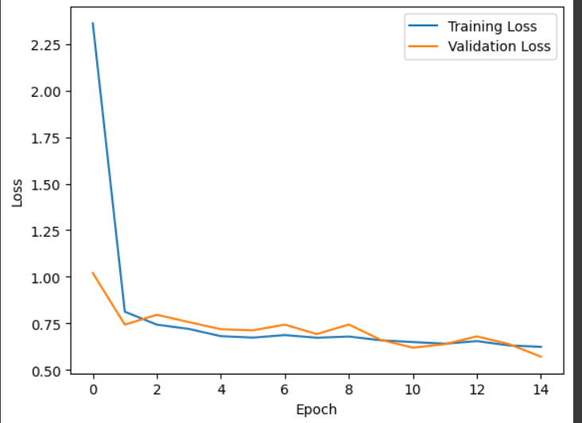
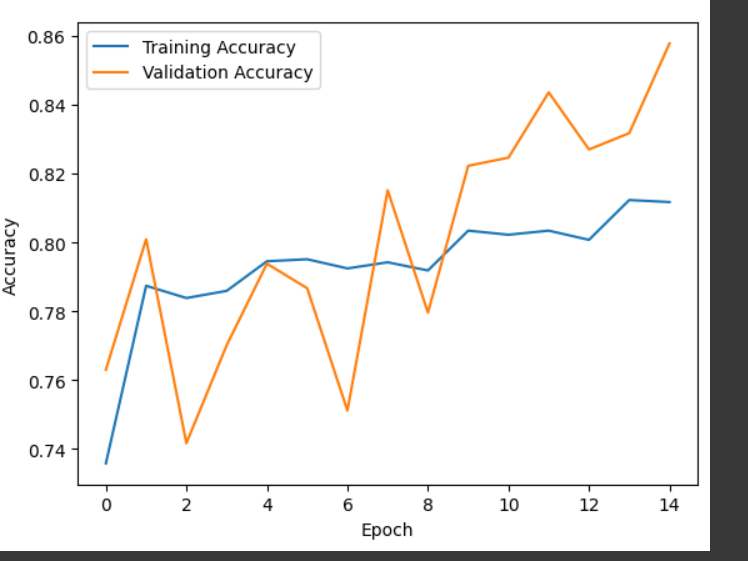
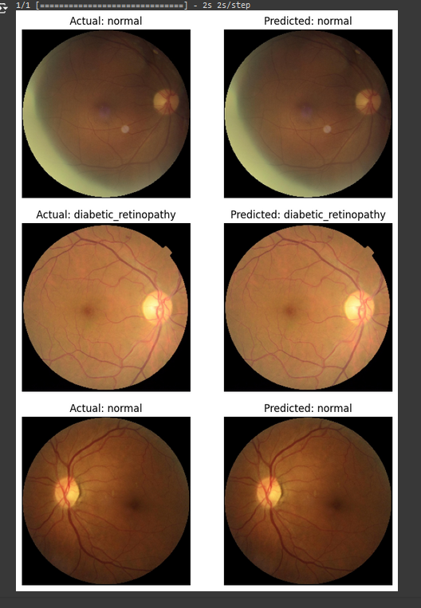

## Dimas Daffa Ernanda
## A11.2022.14079

# Klasifikasi Penyakit Mata Menggunakan Deep Learning

## Ringkasan dan Permasalahan

Proyek ini bertujuan untuk mengklasifikasikan berbagai penyakit mata menggunakan teknik deep learning. Menggunakan dataset gambar mata, model dilatih untuk mengidentifikasi dan mengklasifikasikan berbagai kondisi mata.
Diagnosis penyakit mata yang akurat dan cepat sangat penting untuk pengobatan yang tepat. Namun, hal ini dapat menjadi tantangan bagi para profesional medis karena membutuhkan keahlian khusus dan waktu yang lama.

## Tujuan

Mengembangkan model deep learning yang dapat mengklasifikasikan penyakit mata 
Membantu mempercepat proses diagnosis penyakit mata
Menyediakan alat bantu untuk para profesional medis dalam mengidentifikasi penyakit mata

## Model

Convolutional Neural Network (CNN).

## Alur Project

Persiapan Dataset
Eksplorasi Data dan Preprocessing
Augmentasi Data
Pembuatan Model
Pelatihan Model
Evaluasi Model
Prediksi dan Visualisasi Hasil
Penjelasan Dataset, EDA dan Proses Features Dataset:

## Dataset


Dataset yang digunakan adalah dataset yang diambil dari kaggle.
Dataset berisi gambar-gambar mata dengan berbagai kondisi penyakit seperti Cataract, Glaucoma, Diabetic Retinopathy dan juga mata normal.
Data dibagi menjadi train set, validation, dan test set


### EDA (Exploratory Data Analysis)

Gambar-gambar ditampilkan secara acak untuk memeriksa kualitas dan variasi dataset
Data augmentasi diterapkan pada set pelatihan (rotasi, flip horizontal dan vertikal, perubahan kecerahan)
Label kelas diekstrak dan dienkode secara kategorikal

### Proses features Dataset

1. Pembacaan dan Organisasi Data:
   ```python
   class EyeDiseaseDataset:
       def __init__(self, dataDir):
           self.data_dir = dataDir

       def dataPaths(self):
           filepaths = []
           labels = []
           folds = os.listdir(self.data_dir)
           for fold in folds:
               foldPath = os.path.join(self.data_dir, fold)
               filelist = os.listdir(foldPath)
               for file in filelist:
                   fpath = os.path.join(foldPath, file)
                   filepaths.append(fpath)
                   labels.append(fold)
           return filepaths, labels
   ```
   - Kode ini membaca path file gambar dan labelnya dari direktori dataset.

2. Pembuatan DataFrame:
   ```python
   def dataFrame(self, files, labels):
       Fseries = pd.Series(files, name='filepaths')
       Lseries = pd.Series(labels, name='labels')
       return pd.concat([Fseries, Lseries], axis=1)
   ```
   - Membuat DataFrame yang berisi path file dan label.

3. Pembagian Dataset:
   ```python
   def split_(self):
       files, labels = self.dataPaths()
       df = self.dataFrame(files, labels)
       strat = df['labels']
       trainData, dummyData = train_test_split(df, train_size=0.8, shuffle=True, random_state=42, stratify=strat)
       strat = dummyData['labels']
       validData, testData = train_test_split(dummyData, train_size=0.5, shuffle=True, random_state=42, stratify=strat)
       return trainData, validData, testData
   ```
   - Membagi dataset menjadi train (80%), validation, dan test set (masing-masing 10%).

4. Augmentasi Data:
   ```python
   def augment_data(train_df, valid_df, test_df, batch_size=16):
       img_size = (256,256)
       channels = 3
       color = 'rgb'

       train_datagen = tf.keras.preprocessing.image.ImageDataGenerator(
                 rotation_range=30,
                 horizontal_flip=True,
                 vertical_flip=True,
                 brightness_range=[0.5, 1.5])

       valid_test_datagen = tf.keras.preprocessing.image.ImageDataGenerator()
   ```
   - Mengatur ukuran gambar menjadi 256x256 piksel
   - Menggunakan 3 channel warna (RGB)
   - Menerapkan augmentasi pada training set: rotasi, flip horizontal dan vertikal, perubahan kecerahan

5. Preprocessing Gambar:
   - Dilakukan secara implisit oleh ImageDataGenerator:
     - Rescaling pixel values ke range [0,1]
     - Resizing gambar ke 256x256
     - Konversi ke format tensor yang sesuai untuk input model

6. Encoding Label:
   - Labels diencode secara otomatis menjadi one-hot encoding oleh `flow_from_dataframe` dengan parameter `class_mode='categorical'`

## Proses Learning/Modeling
1. Persiapan Model Dasar:
```python
from tensorflow.keras.applications import EfficientNetB3

base_model = EfficientNetB3(weights='imagenet', include_top=False, input_shape=(256, 256, 3))

for layer in base_model.layers:
    layer.trainable = False
```
- Menggunakan EfficientNetB3 pre-trained pada ImageNet sebagai model dasar
- Mengatur semua layer dari model dasar menjadi non-trainable (transfer learning)

2. Arsitektur Model:
```python
x = base_model.output
x = GlobalAveragePooling2D()(x)
x = Dense(512, activation='relu', kernel_regularizer=regularizers.l2(0.01))(x)
predictions = Dense(classes, activation='softmax', kernel_regularizer=regularizers.l2(0.01))(x)

model = Model(inputs=base_model.input, outputs=predictions)
```
- Menambahkan GlobalAveragePooling2D untuk mengurangi dimensi output
- Dense layer dengan 512 unit dan aktivasi ReLU
- Output layer dengan jumlah unit sesuai jumlah kelas, menggunakan aktivasi softmax
- Menggunakan L2 regularization untuk mencegah overfitting

3. Compile Model:
```python
optimizer = tf.keras.optimizers.Adam(learning_rate=0.001)

model.compile(optimizer=optimizer, loss='categorical_crossentropy', metrics=['accuracy'])
```
- Menggunakan optimizer Adam dengan learning rate 0.001
- Loss function: Categorical Crossentropy (standar untuk klasifikasi multi-class)
- Metrik evaluasi: Accuracy

4. Pelatihan Model:
```python
history = model.fit(
    train_augmented,
    epochs=15,
    validation_data=valid_augmented,
)
```
Epoch 1/15
211/211 [==============================] - 115s 467ms/step - loss: 2.3605 - accuracy: 0.7358 - val_loss: 1.0202 - val_accuracy: 0.7630
Epoch 2/15
211/211 [==============================] - 83s 395ms/step - loss: 0.8125 - accuracy: 0.7874 - val_loss: 0.7430 - val_accuracy: 0.8009
Epoch 3/15
211/211 [==============================] - 82s 386ms/step - loss: 0.7430 - accuracy: 0.7839 - val_loss: 0.7960 - val_accuracy: 0.7417
Epoch 4/15
211/211 [==============================] - 81s 384ms/step - loss: 0.7201 - accuracy: 0.7859 - val_loss: 0.7568 - val_accuracy: 0.7701
Epoch 5/15
211/211 [==============================] - 84s 399ms/step - loss: 0.6811 - accuracy: 0.7945 - val_loss: 0.7185 - val_accuracy: 0.7938
Epoch 6/15
211/211 [==============================] - 82s 388ms/step - loss: 0.6733 - accuracy: 0.7951 - val_loss: 0.7126 - val_accuracy: 0.7867
Epoch 7/15
211/211 [==============================] - 83s 396ms/step - loss: 0.6869 - accuracy: 0.7925 - val_loss: 0.7431 - val_accuracy: 0.7512
Epoch 8/15
211/211 [==============================] - 82s 390ms/step - loss: 0.6727 - accuracy: 0.7942 - val_loss: 0.6922 - val_accuracy: 0.8152
Epoch 9/15
211/211 [==============================] - 81s 383ms/step - loss: 0.6792 - accuracy: 0.7919 - val_loss: 0.7438 - val_accuracy: 0.7796
Epoch 10/15
211/211 [==============================] - 82s 387ms/step - loss: 0.6589 - accuracy: 0.8034 - val_loss: 0.6610 - val_accuracy: 0.8223
Epoch 11/15
211/211 [==============================] - 82s 388ms/step - loss: 0.6496 - accuracy: 0.8023 - val_loss: 0.6195 - val_accuracy: 0.8246
Epoch 12/15
211/211 [==============================] - 82s 387ms/step - loss: 0.6407 - accuracy: 0.8034 - val_loss: 0.6381 - val_accuracy: 0.8436
Epoch 13/15
211/211 [==============================] - 81s 382ms/step - loss: 0.6546 - accuracy: 0.8008 - val_loss: 0.6800 - val_accuracy: 0.8270
Epoch 14/15
211/211 [==============================] - 83s 392ms/step - loss: 0.6314 - accuracy: 0.8123 - val_loss: 0.6387 - val_accuracy: 0.8318
Epoch 15/15
211/211 [==============================] - 80s 381ms/step - loss: 0.6238 - accuracy: 0.8117 - val_loss: 0.5712 - val_accuracy: 0.8578

- Melatih model selama 15 epoch
- Menggunakan data augmentasi untuk training set
- Menggunakan validation set untuk memonitor performa selama pelatihan

5. Monitoring Pelatihan:
```python
train_accuracy = history.history['accuracy']
val_accuracy = history.history['val_accuracy']
print("Training Accuracy:", train_accuracy[-1])
print("Validation Accuracy:", val_accuracy[-1])

plt.plot(history.history['loss'], label='Training Loss')
plt.plot(history.history['val_loss'], label='Validation Loss')
plt.xlabel('Epoch')
plt.ylabel('Loss')
plt.legend()
plt.show()

plt.plot(history.history['accuracy'], label='Training Accuracy')
plt.plot(history.history['val_accuracy'], label='Validation Accuracy')
plt.xlabel('Epoch')
plt.ylabel('Accuracy')
plt.legend()
plt.show()
```
- Mencetak akurasi akhir untuk training dan validation set
- Memvisualisasikan kurva loss dan akurasi selama pelatihan

6. Evaluasi Model:
```python
def plot_actual_vs_predicted(model, test_data, num_samples=3):
    test_images, test_labels = next(iter(test_data))
    predictions = model.predict(test_images)
```
- Fungsi ini digunakan untuk mengevaluasi performa model pada beberapa sampel test

## Perfoma Model
1. Akurasi Akhir:
```python
train_accuracy = history.history['accuracy']
val_accuracy = history.history['val_accuracy']
print("Training Accuracy:", train_accuracy[-1])
print("Validation Accuracy:", val_accuracy[-1])
```
- Menampilkan akurasi akhir untuk data training dan validasi
- Akurasi ini menunjukkan persentase prediksi yang benar pada kedua set data

2. Visualisasi Kurva Loss:
```python
plt.plot(history.history['loss'], label='Training Loss')
plt.plot(history.history['val_loss'], label='Validation Loss')
plt.xlabel('Epoch')
plt.ylabel('Loss')
plt.legend()
plt.show()
```
- Menampilkan grafik loss untuk data training dan validasi selama pelatihan
- Membantu mengidentifikasi overfitting (jika validation loss mulai meningkat sementara training loss terus menurun)
- Menunjukkan seberapa baik model belajar dan generalisasi


3. Visualisasi Kurva Accuracy:
```python
plt.plot(history.history['accuracy'], label='Training Accuracy')
plt.plot(history.history['val_accuracy'], label='Validation Accuracy')
plt.xlabel('Epoch')
plt.ylabel('Accuracy')
plt.legend()
plt.show()
```
- Menampilkan grafik akurasi untuk data training dan validasi selama pelatihan
- Membantu melihat peningkatan performa model seiring berjalannya epoch
- Dapat mengindikasikan overfitting jika ada gap besar antara training dan validation accuracy


4. Evaluasi Visual pada Data Test:
```python
def plot_actual_vs_predicted(model, test_data, num_samples=3):
    test_images, test_labels = next(iter(test_data))
    predictions = model.predict(test_images)
    
    class_labels = list(train_augmented.class_indices.keys())
    
    sample_indices = np.random.choice(range(len(test_images)), num_samples, replace=False)
    
    for i in sample_indices:
        actual_label = class_labels[np.argmax(test_labels[i])]
        predicted_label = class_labels[np.argmax(predictions[i])]
        plt.figure(figsize=(8, 4))
        # Actual Image
        plt.subplot(1, 2, 1)
        plt.imshow(test_images[i].astype(np.uint8))
        plt.title(f'Actual: {actual_label}')
        plt.axis('off')
        # Predicted Image
        plt.subplot(1, 2, 2)
        plt.imshow(test_images[i].astype(np.uint8))
        plt.title(f'Predicted: {predicted_label}')
        plt.axis('off')
        plt.show()
```
- Fungsi ini memvisualisasikan performa model pada beberapa sampel dari data test
- Menampilkan gambar asli dengan label sebenarnya dan prediksi model
- Membantu menilai kualitas prediksi model secara visual


## Diskusi Hasil dan Kesimpulan

### Hasil

Model menunjukkan peningkatan akurasi selama pelatihan
Visualisasi hasil menunjukkan kemampuan model dalam mengklasifikasikan penyakit mata
Penggunaan EfficientNetB3 dan teknik transfer learning efektif untuk tugas klasifikasi ini
Augmentasi data membantu meningkatkan generalisasi model

## Kesimpulan
Model deep learning yang dikembangkan menunjukkan potensi yang baik dalam mengklasifikasikan penyakit mata. Dengan pengembangan lebih lanjut, sistem ini dapat menjadi alat yang berharga bagi profesional medis dalam diagnosis penyakit mata.
